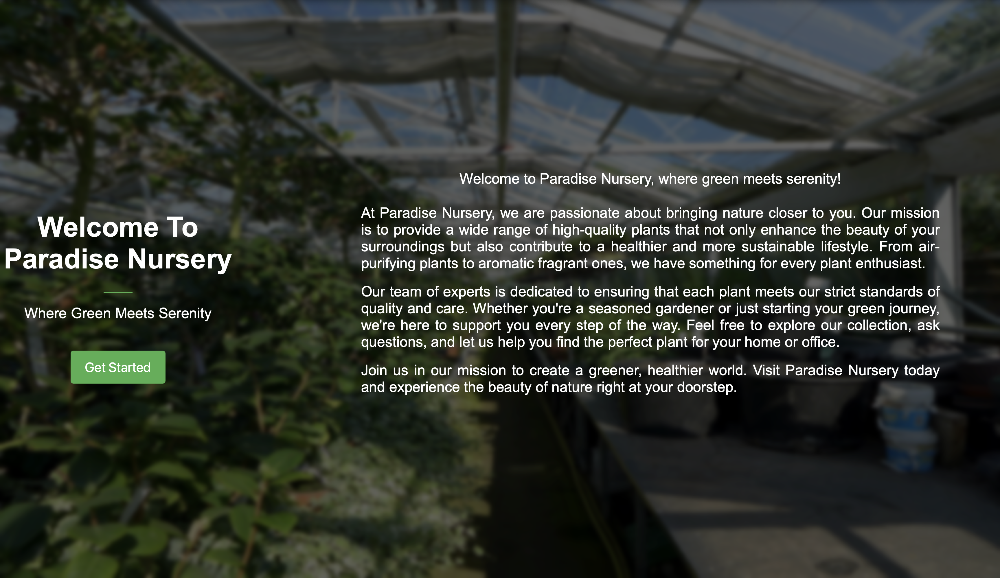
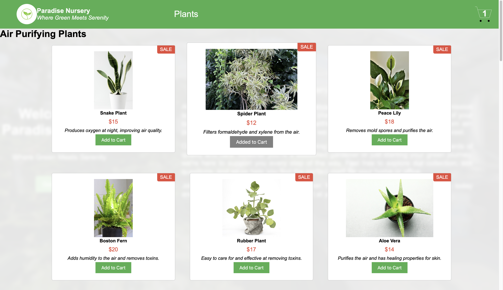
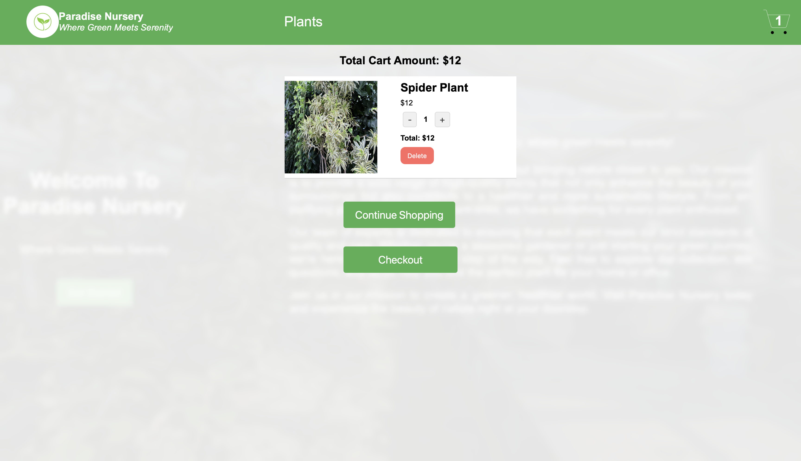

# Aplicación de Carrito de Compra de Plantas

[🇬🇧 English version](README.md)

Proyecto final del curso de IBM **Developing Front-End Applications with React**.

**Demo:** [Plant Shopping Application](https://raulpracticareact.github.io/plantShopping/)

## Descripción General

Este proyecto es una demo de comercio electrónico creada con React para **Paradise Nursery**, una tienda de plantas donde los usuarios pueden explorar plantas de interior, añadir productos al carrito y gestionar cantidades antes de finalizar la compra.

La aplicación comienza con una pantalla principal que presenta Paradise Nursery e incluye un botón **Get Started**. Después de entrar en la tienda, los usuarios pueden ver tarjetas de plantas agrupadas por categoría, añadir productos al carrito, ver cómo se actualiza el contador del carrito y gestionar los productos seleccionados desde la página del carrito.

## Capturas de Pantalla

### Pantalla Principal

`img/ePlant1.png` muestra la pantalla principal con la presentación de Paradise Nursery y el botón Get Started.

<p align="center">
  
</p>

### Listado de Productos

`img/ePlant2.png` muestra el catálogo de plantas, incluyendo tarjetas de producto, precios, descripciones, etiquetas de oferta, botones Add to Cart y el indicador de cantidad del carrito.

<p align="center">
  
</p>

### Carrito de Compra

`img/ePlant3.png` muestra la página del carrito, donde los usuarios pueden revisar los productos seleccionados, actualizar cantidades, eliminar productos, continuar comprando o pulsar el botón de checkout de ejemplo.

<p align="center">
  
</p>

## Tecnologías Utilizadas

- **React:** Construye la interfaz de usuario mediante componentes reutilizables.
- **Redux Toolkit:** Gestiona el estado del carrito en toda la aplicación.
- **React Redux:** Conecta los componentes de React con el store de Redux.
- **Vite:** Proporciona el servidor de desarrollo y las herramientas de compilación.
- **CSS:** Gestiona el diseño personalizado, las tarjetas de producto, los botones, la barra de navegación y los estilos responsivos.
- **GitHub Pages:** Se utiliza para el despliegue.

## Funcionalidades

- **Pantalla Principal:** Muestra un fondo de invernadero, el mensaje de marca de Paradise Nursery, una sección About Us y un botón Get Started.
- **Página de Productos:** Muestra cinco categorías de plantas, cada una con seis tarjetas que incluyen imagen, nombre, precio, descripción y etiqueta de oferta.
- **Añadir al Carrito:** Añade una planta al estado del carrito en Redux y cambia el botón del producto seleccionado a **Added to Cart**.
- **Contador del Carrito:** Muestra desde la barra de navegación la cantidad total de productos añadidos al carrito.
- **Gestión del Carrito:** Permite incrementar, decrementar o eliminar productos del carrito mientras los totales se actualizan dinámicamente.
- **Continuar Comprando:** Permite volver desde el carrito al listado de productos.
- **Checkout de Ejemplo:** El botón Checkout muestra actualmente una alerta porque el flujo de checkout aún no está implementado.

## Componentes Principales

### `App.jsx`

Controla la transición desde la pantalla principal hasta la página de productos. Renderiza la introducción de Paradise Nursery, el contenido de About Us y el componente `ProductList` cuando el usuario pulsa Get Started.

### `ProductList.jsx`

Muestra el catálogo de plantas y la barra de navegación. Define los datos de las plantas, renderiza las tarjetas agrupadas por categoría, gestiona las acciones de Add to Cart, controla si la vista del carrito está visible y calcula la cantidad del carrito mostrada en la barra de navegación.

### `CartItem.jsx`

Muestra el contenido actual del carrito. Calcula el importe total, permite aumentar o disminuir cantidades, eliminar productos, volver a comprar y mostrar una alerta de checkout de ejemplo.

### `CartSlice.jsx`

Define el slice de Redux del carrito con acciones para añadir productos, eliminarlos y actualizar cantidades.

## Categorías Actuales de Productos

- Air Purifying Plants
- Aromatic Fragrant Plants
- Insect Repellent Plants
- Medicinal Plants
- Low Maintenance Plants

## Mejoras Futuras

- Implementar un proceso de checkout completo.
- Añadir más productos y categorías.
- Añadir autenticación de usuarios.
- Integrar procesamiento de pagos.
- Mejorar la identificación de productos para plantas que aparecen en más de una categoría.

## Instrucciones de Instalación

1. Clona el repositorio:

   ```bash
   git clone https://github.com/RaulEstevezA/e-plantShopping.git
   ```

2. Accede al directorio del proyecto:

   ```bash
   cd e-plantShopping
   ```

3. Instala las dependencias:

   ```bash
   npm install
   ```

4. Inicia el servidor de desarrollo:

   ```bash
   npm run dev
   ```

5. Abre el navegador y accede a:

   ```text
   http://localhost:5173
   ```

## Despliegue

Compila el proyecto con:

```bash
npm run build
```

Despliega en GitHub Pages con:

```bash
npm run deploy
```

## Licencia

Este proyecto está licenciado bajo la licencia MIT.
